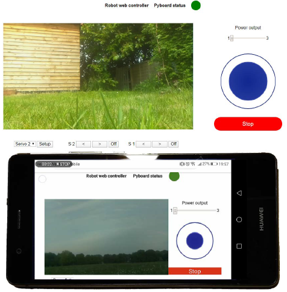
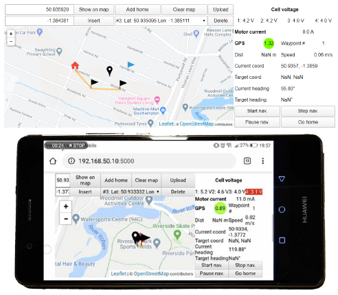
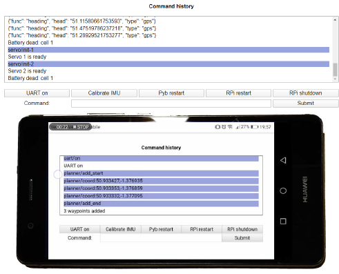
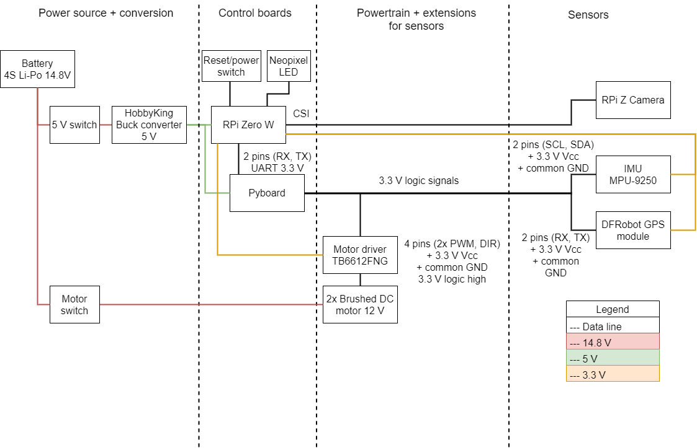
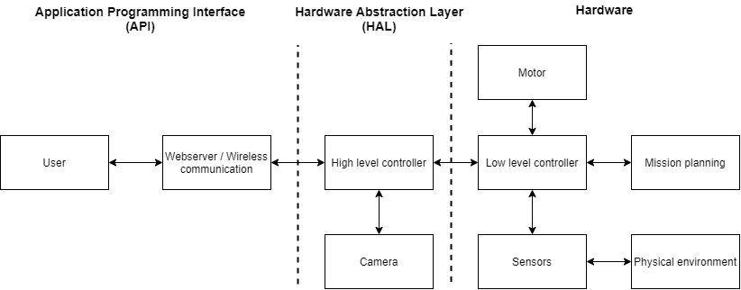

# Off-road-Robot-Platform
This repository contains the instructions and code to set up an off-road tracked platform using DFRobot's Yuewalker chassis.

This is how the assembled robot will look like:


The webserver was developed to be mobile friendly. The following pictures show how the UI looks like on desktop (top view) and on a mobile device (bottom view).

## Control panel

The first panel is the control panel. On the top, the green circle indicates that the UART communication between the Raspberry Pi and Pyboard works properly. If there is an error, it will turn red. The live camera feed is displayed on the left. The robot can be controlled by the blue joystick on the right. The output from the joystick is transformed into left and right motor values using the arcade mixing function. The different power settings enable precise and fast movements. On the bottom, the servos can be setup on the go. Once the user clicks setup, the servo can be plugged in into the corresponding port and it can be controlled using the two arrows. Servos can be deinitialized by clicking the off button.

## Navigation panel

The second panel is used for setting up and monitoring the autonomous mode. The map is displayed using the Leaflet JavaScript library. The map tiles were downloaded using the RgoogleMaps package and are stored on the Raspberry Pi. This enables the users to use the map without internet connection. Waypoints can either be added by entering their latitude and longitude or simply by clicking on the map. The waypoint can then be added to the list by clicking insert. Any waypoint can be removed from or added to the list, or can be set as home. Waypoints are uploaded to the Pyboard by clicking the upload button. Data such as the battery voltage, the motor’s current consumption and navigation information are displayed on the right. When the navigation is started the bottom four buttons will have the same colours as the LEDs.

## Command history

The third panel shows the command history. To distinguish between the Pyboard’s and the Rasperry Pi’s messages, those sent by the Raspberry Pi have a blue background. The most popular actions can be called by clicking the buttons, or the user can issue any command by entering it to the input box.

# Setup
## Hardware
The robot uses two MCUs, a Pyboard v1.1 and a Raspberry Pi Zero W. The latter can be exchanged to any WiFi enabled Raspberry Pi.
The schematic, layout and bill of materials to assemble the control unit can be found in the control-unit folder.
## Pyboard
The application requires threads and double precision floating points. To achieve this, the firmware needs to be updated from [the official website](https://micropython.org/download/pybv1/).
The code is located in the micropython folder. Without precompilation, its size too big to store on the Pyboard's flash, so an SD card is required.
### SD card booting
The SD card cannot be directly mounted on startup, because the buck converter cannot handle the sudden current surge. To fix this, put the pybrestart.py file on the flash. This will do a hard reset after 3 seconds. Then the SD card will be mounted.
### Files
Upload all the files from the micropython folder to the Pyboard's SD card except for the pybrestart.py
## Raspberry Pi
### [Enable I2C and SSH](https://itsfoss.com/ssh-into-raspberry/)
### Install Flask
```
sudo pip install flask + pip install -U flask-cors
```
Here are some useful flask tutorials:
* https://learn.sparkfun.com/tutorials/using-flask-to-send-data-to-a-raspberry-pi/all
* https://www.instructables.com/id/Smooth-Web-Browser-Motor-Control/
* https://pythonhow.com/add-css-to-flask-website/

### Access point
Follow [this tutorial](https://www.raspberryconnect.com/projects/65-raspberrypi-hotspot-accesspoints/168-raspberry-pi-hotspot-access-point-dhcpcd-method).
If you get at any point a "Temporary failure in name resolution" error you can fix it by running
```
sudo sh –c ‘echo “nameserver 8.8.8.8” >> /etc/resolv.conf’
```
### Files
Upload the files from the rpi folder. The script is started by running thread.py. To run it, use the following command:
```
sudo -E -H python3 thread.py
```
### Starting script on boot
Use the rc.local method with the commmand above following [this tutorial](https://www.dexterindustries.com/howto/run-a-program-on-your-raspberry-pi-at-startup/)
### Reverting to WiFi
By running wifi-access.sh you can revert back to using WiFi. Conversely, by running access-point.sh the Raspberry Pi will act as an access point. You must restart before the changes take place.
### Offline map tiles
You can save Google Maps tiles from your desired area using [this tutorial](http://rgooglemaps.r-forge.r-project.org/OfflineMaps-RgoogleMaps-leaflets.html). Once you downloaded the map tiles, save it on the Raspberry Pi in the app/static/mapTiles folder.
# Operation
Here is an overview of the components:

Below is the system's block diagram

## Commands
To see the full list of complete commands, examine the cmd.py file in the micropython/lib directory.

